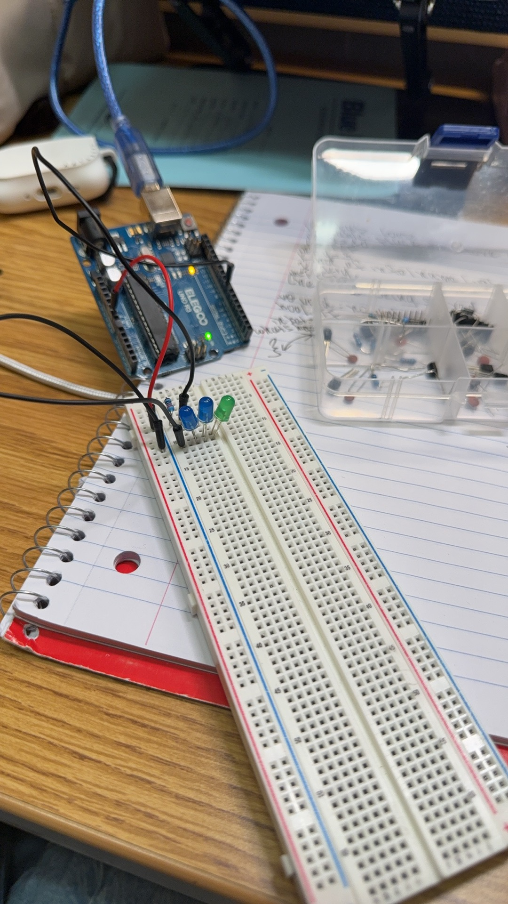
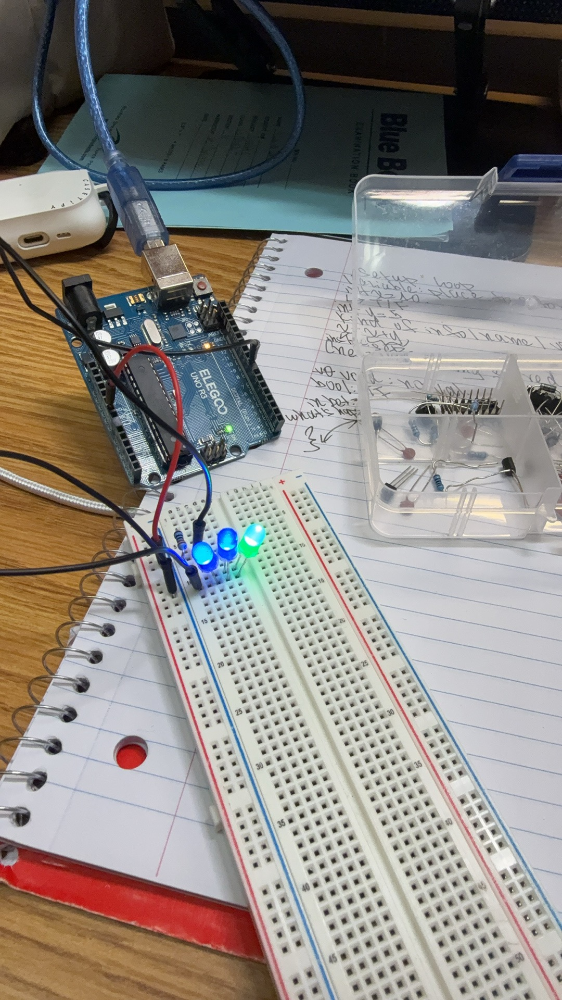

# Interactive Arduino Device: Pedestrian Crossing

## My Process

On Day 8, I worked on a circuit with multiple LEDs and learned how to connect several LEDs to the same breadboard and control each one with a different Arduino pin. For my summative, I wanted to build on that instead of making another circuit where LEDs just blinked. I decided to make a pedestrian crossing system because it gave the LEDs specific purposes and let me add both an input and another type of output.

My project models a crossing with separate signals for cars and pedestrians. The car signal has red, yellow, and green LEDs, while the pedestrian signal has a red DON'T WALK light and a green WALK light. A pushbutton represents the button a pedestrian would press to request a crossing, and a piezo buzzer provides a sound signal. Normally, the car light stays green, the pedestrian light stays red, and the buzzer stays silent. When someone presses the button, the car light changes from green to yellow and then red. After a short pause, the pedestrian light turns green and the buzzer makes slow, short chirps. Near the end of the crossing time, the green light flashes and the chirps become faster. The pedestrian light then returns to red, the sound stops, and the car light returns to green.





*My multiple-LED circuit from Day 8, which I used as the starting point for my pedestrian crossing.*

I started by building the LED portion of the crossing. I connected the red, yellow, and green LEDs for the car signal to pins 8, 9, and 10. I tested each LED separately before putting them into a sequence. Once they worked, I used `digitalWrite()` to turn specific lights on and off and `delay()` to control how long each state lasted. I then added a green pedestrian LED on pin 11 and a red pedestrian LED on pin 12. I changed the sequence so the pedestrian light stayed red while cars could move and only changed to green after the car signal reached red.


*I added a separate red pedestrian LED so the crossing could show both WALK and DON'T WALK.*

Next, I added a pushbutton so the crossing would respond to a person instead of cycling automatically. I connected the button to pin 2 and ground and used `INPUT_PULLUP` in the code. This means the Arduino normally reads the button as `HIGH` and reads it as `LOW` when someone presses it. I used the button tutorial to understand `INPUT_PULLUP` and `digitalRead()`, and I used some AI assistance to help me connect the button input to the traffic-light sequence I had already written. I then tested the button on the actual circuit to make sure pressing it started the sequence correctly.


*I added a pushbutton so a pedestrian could start the crossing sequence.*

While adding the button, I realized that I had forgotten to grab enough jumper wires. Most of my wires were already being used by the LEDs, so I could not connect everything at the same time. I temporarily removed the red pedestrian LED and reused one of its connections. In that version, the green pedestrian LED being on meant WALK and having it off meant WAIT. This let me continue testing the button. After I got more jumper wires, I added the red pedestrian LED back and returned to my original five-LED design.

Once the lights and button worked, I added a piezo buzzer as another output. I connected the buzzer to pin 3 and ground and tested it separately before putting it into the full program. I used AI assistance to help me write the repeated chirps with a `for` loop and combine the sound with the flashing pedestrian light. My first version used longer tones around 1000 Hz. The buzzer worked, but the sound was too harsh, so I changed the frequency and delays and tested the result. I eventually used shorter chirps around 700 Hz during the normal WALK period and faster chirps during the ending warning.


*I added a piezo buzzer to give the pedestrian signal an audible output in addition to the LEDs.*

I wrote and tested the program in stages instead of starting with the final code. I started with the LED commands I had already practiced in class, then added the pedestrian lights, button input, buzzer, and warning sequence as I added those parts to the circuit. I used the class tutorials and Arduino documentation to understand the components and commands, and I used some AI assistance when I needed help writing or combining parts of the code. After each major change, I uploaded the program and tested it on the Arduino. I then changed the code based on what the circuit actually did, such as adjusting the buzzer sound after hearing the first version.

After everything worked, my last step was reorganizing the wiring. Because I had added components at different times, several jumper wires crossed over each other or were longer than necessary. I moved the wires so their paths were easier to follow and the final circuit was more organized. After moving them, I tested the crossing again to make sure I had not accidentally changed any connections.

My final circuit uses five LEDs, one pushbutton, and one piezo buzzer. Pins 8, 9, and 10 control the car lights, pins 11 and 12 control the pedestrian lights, pin 2 reads the button, and pin 3 controls the buzzer. The button starts the crossing, the LEDs control the car and pedestrian signals, and the buzzer changes its rhythm as the pedestrian crossing time runs out.

### Final Demonstration

[Watch my final pedestrian crossing demonstration](images/arduino-final-demo.mov)

*My completed pedestrian crossing. The video shows the organized final circuit and the full sequence from the button press through the WALK signal, ending warning, and return to the normal traffic state.*

### Final Code

```cpp
const int carRed = 8;
const int carYellow = 9;
const int carGreen = 10;

const int walkGreen = 11;
const int walkRed = 12;

const int button = 2;
const int buzzer = 3;

void setup() {
  pinMode(carRed, OUTPUT);
  pinMode(carYellow, OUTPUT);
  pinMode(carGreen, OUTPUT);

  pinMode(walkGreen, OUTPUT);
  pinMode(walkRed, OUTPUT);

  pinMode(button, INPUT_PULLUP);
  pinMode(buzzer, OUTPUT);
}

void loop() {
  // normal state
  digitalWrite(carRed, LOW);
  digitalWrite(carYellow, LOW);
  digitalWrite(carGreen, HIGH);

  digitalWrite(walkRed, HIGH);
  digitalWrite(walkGreen, LOW);

  noTone(buzzer);

  // start crossing when the button is pressed
  if (digitalRead(button) == LOW) {
    delay(1000);

    // cars slow down
    digitalWrite(carGreen, LOW);
    digitalWrite(carYellow, HIGH);
    delay(2000);

    // cars stop
    digitalWrite(carYellow, LOW);
    digitalWrite(carRed, HIGH);
    delay(1000);

    // pedestrians can walk
    digitalWrite(walkRed, LOW);
    digitalWrite(walkGreen, HIGH);

    // slow chirps while walking
    for (int i = 0; i < 4; i++) {
      tone(buzzer, 700);
      delay(80);
      noTone(buzzer);
      delay(700);
    }

    // faster warning at the end
    for (int i = 0; i < 4; i++) {
      digitalWrite(walkGreen, LOW);
      tone(buzzer, 850);
      delay(70);
      noTone(buzzer);
      delay(250);

      digitalWrite(walkGreen, HIGH);
      tone(buzzer, 850);
      delay(70);
      noTone(buzzer);
      delay(250);
    }

    // pedestrians stop
    digitalWrite(walkGreen, LOW);
    digitalWrite(walkRed, HIGH);
    noTone(buzzer);
    delay(1000);

    // cars can go again
    digitalWrite(carRed, LOW);
    digitalWrite(carGreen, HIGH);

    // wait for the button to be released
    while (digitalRead(button) == LOW) {
      delay(10);
    }
  }
}
```

## Peer Support

At the beginning of the project, Cecilia and I were initially working together, and I needed help figuring out how to turn the multiple-LED circuit I already knew how to build into an interactive device with a clear purpose. I knew I wanted to use multiple LEDs, but I was not sure what the LEDs should represent or how an input could affect them. Cecilia suggested using the LEDs to model a traffic light and pedestrian crossing, with a button that a pedestrian could press to request a crossing. We talked through how the red, yellow, and green LEDs could control traffic while separate lights could tell pedestrians when to walk. Her idea gave me a specific use for both the LEDs and the button, so I used the pedestrian crossing as the basis of my project. When we later worked separately, I continued developing the idea by adding separate WALK and DON'T WALK lights, a buzzer, and the full crossing sequence.

## Use-Case Reflection

This project could be useful for a pedestrian crossing where pedestrians need to know when to cross and drivers need to know when to stop. The button lets a pedestrian request a crossing instead of having the pedestrian signal run continuously. The car and pedestrian lights then show which group can move. The buzzer adds an audible signal so the pedestrian does not have to rely only on the WALK light. The faster chirps and flashing light near the end also give a warning that the crossing time is ending.

To make my prototype useful at a real crossing, I would need to replace the small LEDs with larger and brighter traffic signals and use electronics that could work reliably outdoors. The timing and sound patterns would also need to follow actual traffic and accessibility standards rather than the values I chose for my model. I could also add sensors to detect cars or pedestrians and adjust the timing instead of always running the same sequence.

The skill I would rely on most if I continued developing this project is debugging. I found that testing one component at a time made it much easier to find problems. I tested the LEDs, button, and buzzer separately before combining them, and I changed one part at a time when something did not work the way I wanted. I would use the same process when adding more complicated features so I could tell whether a problem came from the wiring, code, or a specific component.

## Resources

- [Makeability Lab — Intro to Output](https://makeabilitylab.github.io/physcomp/arduino/intro-output.html)
- [Makeability Lab — Using Buttons](https://makeabilitylab.github.io/physcomp/arduino/buttons.html)
- [Arduino — Built-in Examples](https://docs.arduino.cc/built-in-examples/)
- [Arduino — Language Reference](https://docs.arduino.cc/language-reference/)
