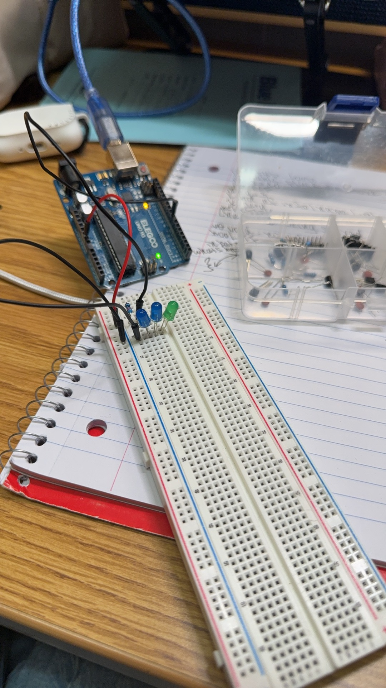
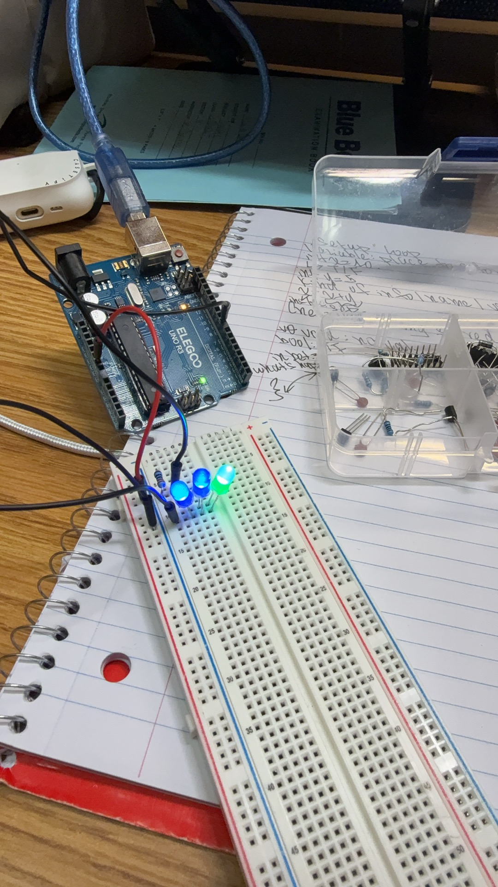

# Interactive Arduino Device: Pedestrian Crossing

## My Process

On Day 8, I worked on a circuit with multiple LEDs and learned how to connect several LEDs to the same breadboard and control each one with a different Arduino pin. For my summative, I wanted to build on that skill instead of making another circuit where LEDs just blinked. I decided to make a pedestrian crossing system because it gave each LED a specific purpose and allowed me to build on a circuit I already understood while adding an input and a new type of output.

My project models a crossing with separate signals for cars and pedestrians. The car signal has red, yellow, and green LEDs, while the pedestrian signal has a red DON'T WALK light and a green WALK light. A pushbutton represents the button a pedestrian would press to request a crossing, and a piezo buzzer provides an audible signal. Normally, the car light stays green, the pedestrian light stays red, and the buzzer stays silent. When someone presses the button, the car light changes from green to yellow and then red. After a short pause, the pedestrian light turns green and the buzzer makes slow, short chirps. Near the end of the crossing time, the green pedestrian light flashes and the chirps become faster. The pedestrian light then returns to red, the sound stops, and the car light returns to green.





*My multiple-LED circuit from Day 8, which I used as the starting point for my pedestrian crossing.*

I started by building the LED portion of the crossing. I connected the red, yellow, and green LEDs for the car signal to pins 8, 9, and 10. Each LED was connected through a resistor and back to ground so that current could flow through the LED without damaging it. I tested each LED separately before putting them into a sequence. Once they worked, I used `digitalWrite()` to turn specific lights on and off and `delay()` to control how long each state lasted.

I then added a green pedestrian LED on pin 11 and a red pedestrian LED on pin 12. I changed the sequence so the pedestrian light stayed red while cars could move and only changed to green after the car signal reached red. Building the circuit in stages made it easier to tell which connection was causing a problem if one of the LEDs did not behave correctly.


*I added a separate red pedestrian LED so the crossing could show both WALK and DON'T WALK.*

Next, I added a pushbutton so the crossing would respond to a person instead of cycling automatically. I connected the button to pin 2 and ground and used `INPUT_PULLUP` in the code. I used the Makeability Lab button tutorial and Arduino examples to learn how `digitalRead()` and `INPUT_PULLUP` work. I also used AI when I had questions about the code and to help me organize and combine different parts of my program. I used those explanations to understand how the button input could trigger the traffic-light sequence I had already built, then uploaded and tested the code on the actual Arduino.


*I added a pushbutton so a pedestrian could start the crossing sequence.*

One problem I ran into while adding the button was that I had not grabbed enough jumper wires. Most of my wires were already being used by the LEDs, so I could not connect every component at the same time. Instead of stopping the project, I temporarily removed the red pedestrian LED and reused one of its connections. In that version, the green pedestrian LED being on meant WALK and having it off meant WAIT. This allowed me to continue testing the button and code even though the circuit was incomplete. After I got more jumper wires, I added the red pedestrian LED back and returned to the five-LED design.

For my new component, I chose a piezo buzzer. I had already worked with LEDs and buttons during the unit, but I wanted to add another type of output so that the crossing could communicate through sound as well as light. I used Arduino's documentation and examples for `tone()` and `noTone()` to understand how to control the buzzer. I connected it to pin 3 and ground and tested it separately before adding it to the complete circuit.

I also used AI assistance while working with the buzzer and the larger program. When I had questions about how parts of the code worked, I asked for explanations, and I used AI to help me organize sections of code I had been developing separately. For example, it helped me understand how I could use a `for` loop for repeated chirps instead of writing the same commands many times. I still tested each change on the physical Arduino and adjusted the code based on what the circuit actually did.

My first buzzer version did not sound the way I wanted. I used longer tones around 1000 Hz. The buzzer worked technically, but the sound was too harsh. I changed the frequency and delays and repeatedly tested the result. I eventually used short chirps around 700 Hz during the normal WALK period and faster, higher chirps during the ending warning. This gave the two stages of the pedestrian signal noticeably different sounds.


*I added a piezo buzzer to give the pedestrian signal an audible output in addition to the LEDs.*

I wrote and tested the program in stages instead of trying to write the entire final program at once. I started with the LED commands I had already practiced in class, then added the pedestrian lights, button input, buzzer, and warning sequence as I added those components to the circuit. I used the Arduino IDE to upload each version to the board and test it. When something did not behave the way I expected, I changed one part at a time so I could determine whether the problem came from the wiring or the code.

I also ran into an upload problem when the Arduino IDE could not open the selected USB port. I checked the connection and selected the working Arduino port before uploading again. Once that was fixed, I could continue testing the program. This was different from a problem in my code because the sketch could compile successfully even though it could not be uploaded to the board.

After everything worked, my last step was reorganizing the wiring. Because I had added components at different times, several jumper wires crossed over each other or were longer than necessary. I moved the wires so their paths were easier to follow and the final circuit was more organized. After moving them, I tested the crossing again to make sure I had not accidentally changed any connections.

My final circuit uses five LEDs, one pushbutton, and one piezo buzzer. Pins 8, 9, and 10 control the car lights, pins 11 and 12 control the pedestrian lights, pin 2 reads the button, and pin 3 controls the buzzer. The button starts the crossing, the LEDs control the car and pedestrian signals, and the buzzer changes its rhythm as the pedestrian crossing time runs out.

## Technical Tidbit: How the Pushbutton Input Works

One part of my project that I wanted to understand beyond simply getting it to work was the pushbutton input. I connected the button between pin 2 and ground and set the pin to `INPUT_PULLUP`:

```cpp
pinMode(button, INPUT_PULLUP);
```

A digital input can be read as either `HIGH` or `LOW`. However, if an input pin is not connected to a definite voltage, it can "float" and give unreliable readings. `INPUT_PULLUP` solves this by activating a pull-up resistor built into the Arduino. This resistor weakly connects the input pin to 5V, giving pin 2 a stable `HIGH` reading while the button is not being pressed.

When the button is pressed, it connects pin 2 to ground. This pulls the voltage down to 0V, so the Arduino reads `LOW`. Because of this, the button logic is the reverse of what I originally expected: `HIGH` means the button is not pressed, while `LOW` means it is pressed. That is why my crossing begins with:

```cpp
if (digitalRead(button) == LOW) {
```

Using `INPUT_PULLUP` also means that I do not need to add a separate pull-up or pull-down resistor for the button.

Another issue with physical buttons is **button bounce**. The metal contacts inside a button can make and break contact several times very quickly when the button is pressed or released. Even though a person presses the button once, the Arduino could potentially detect several rapid changes between `HIGH` and `LOW`. Preventing those extra readings is called **debouncing**.

My program does not use a complete software debouncing system, but once it detects a button press, it enters the crossing sequence instead of immediately checking for another press. At the end, it also waits for the button to be released:

```cpp
while (digitalRead(button) == LOW) {
  delay(10);
}
```

If I developed the input system further, I could add deliberate software debouncing by checking that the input remains stable for a short amount of time before accepting it as a press. Learning how `INPUT_PULLUP` and button bounce work helped me understand that the button is not simply sending a "pressed" command to the Arduino. The microcontroller is actually reading changes in voltage and my code decides what those readings mean.

## Final Demonstration

[Watch my final pedestrian crossing demonstration](images/arduino-final-demo.mov)

*My completed pedestrian crossing. The video shows the organized final circuit and the full sequence from the button press through the WALK signal, ending warning, and return to the normal traffic state.*

## Final Code

```cpp
const int carRed = 8;
const int carYellow = 9;
const int carGreen = 10;

const int walkGreen = 11;
const int walkRed = 12;

const int button = 2;
const int buzzer = 3;

void setup() {
  pinMode(carRed, OUTPUT);
  pinMode(carYellow, OUTPUT);
  pinMode(carGreen, OUTPUT);

  pinMode(walkGreen, OUTPUT);
  pinMode(walkRed, OUTPUT);

  pinMode(button, INPUT_PULLUP);
  pinMode(buzzer, OUTPUT);
}

void loop() {
  // normal state
  digitalWrite(carRed, LOW);
  digitalWrite(carYellow, LOW);
  digitalWrite(carGreen, HIGH);

  digitalWrite(walkRed, HIGH);
  digitalWrite(walkGreen, LOW);

  noTone(buzzer);

  // start crossing when the button is pressed
  if (digitalRead(button) == LOW) {
    delay(1000);

    // cars slow down
    digitalWrite(carGreen, LOW);
    digitalWrite(carYellow, HIGH);
    delay(2000);

    // cars stop
    digitalWrite(carYellow, LOW);
    digitalWrite(carRed, HIGH);
    delay(1000);

    // pedestrians can walk
    digitalWrite(walkRed, LOW);
    digitalWrite(walkGreen, HIGH);

    // slow chirps while walking
    for (int i = 0; i < 4; i++) {
      tone(buzzer, 700);
      delay(80);
      noTone(buzzer);
      delay(700);
    }

    // faster warning at the end
    for (int i = 0; i < 4; i++) {
      digitalWrite(walkGreen, LOW);
      tone(buzzer, 850);
      delay(70);
      noTone(buzzer);
      delay(250);

      digitalWrite(walkGreen, HIGH);
      tone(buzzer, 850);
      delay(70);
      noTone(buzzer);
      delay(250);
    }

    // pedestrians stop
    digitalWrite(walkGreen, LOW);
    digitalWrite(walkRed, HIGH);
    noTone(buzzer);
    delay(1000);

    // cars can go again
    digitalWrite(carRed, LOW);
    digitalWrite(carGreen, HIGH);

    // wait for the button to be released
    while (digitalRead(button) == LOW) {
      delay(10);
    }
  }
}
```

## Peer Support

At the beginning of the project, Cecilia and I mistakenly thought that the summative was a partner project, so we started working on the pedestrian crossing together. We came up with the overall idea together and discussed how the traffic lights, pedestrian signals, and button would work. One thing I needed help with was figuring out how to turn the multiple LEDs I already knew how to use into an interactive device with a clear purpose. Cecilia helped develop the idea of modeling a traffic light and pedestrian crossing and worked with me on parts of the circuit and code, including figuring out the order and timing of the light sequence. This changed how I approached the project because instead of treating the LEDs as separate outputs, I began thinking of them as parts of one system where each light represented a specific state.

I worked on connecting and testing the different parts of the circuit and putting the full sequence together. I added and tested the pedestrian lights, pushbutton, and piezo buzzer and worked on integrating them into the code. I also developed the different buzzer patterns and ending warning, tested and adjusted the timing and sound, troubleshot problems as they came up, and reorganized the wiring for the final circuit. Cecilia also helped test the system and make adjustments to parts of the code as we worked.

Later, we found out that the summative was intended to be an individual project. By then, we had already worked together for much of the available project time, and there was not enough time for Cecilia to restart and construct an entirely new project. We continued from the work we had already completed rather than starting over. This experience also showed me that collaboration can affect the direction of a design early in the process, especially when another person suggests a way of using components that I had not considered.

## Use-Case Reflection

This project could be useful for a pedestrian crossing where pedestrians need to know when it is safe to cross and drivers need to know when to stop. The button lets a pedestrian request a crossing instead of having the pedestrian signal run continuously. The car and pedestrian lights then communicate which group can move. The buzzer adds an audible signal so that the crossing does not rely only on the WALK light. The faster chirps and flashing light near the end also provide a warning that the crossing time is ending.

To make my prototype actually useful at a real crossing, I would need to replace the small LEDs with larger and brighter traffic signals and use electronics and a protective enclosure that could work reliably outdoors. The timing and sound patterns would also need to follow actual traffic and accessibility standards rather than the values I chose for my model. I could add sensors to detect cars or pedestrians so that the system could respond to its surroundings instead of always running the same sequence. I would also need a more reliable input system with proper button debouncing.

The skill from this unit that I would rely on most if I continued developing this idea is **debugging**. I found that testing one component at a time made it much easier to locate problems. I tested the LEDs, button, and buzzer separately before combining them, and I changed one part at a time when something did not work the way I wanted. That helped me distinguish between wiring problems, code problems, and design choices that technically worked but needed improvement, such as the original buzzer sound.

If I did another project like this, I would plan and test the input and output components separately earlier in the process before combining them. I would also leave more time for testing the completed system instead of focusing only on getting each individual component to work. This would make it easier to isolate problems and give me more time to improve the final design rather than just fixing it.

## Resources

- [Makeability Lab — Intro to Output](https://makeabilitylab.github.io/physcomp/arduino/intro-output.html)
- [Makeability Lab — Using Buttons](https://makeabilitylab.github.io/physcomp/arduino/buttons.html)
- [Arduino — Built-in Examples](https://docs.arduino.cc/built-in-examples/)
- [Arduino — Language Reference](https://docs.arduino.cc/language-reference/)
